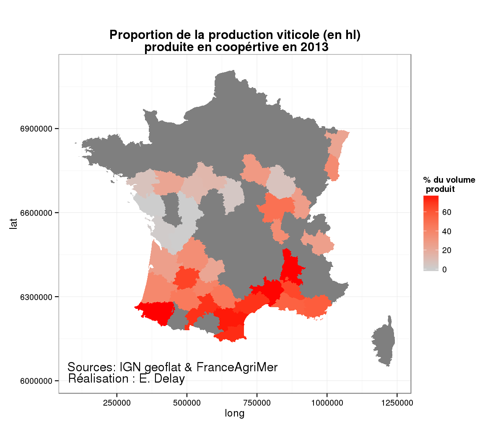
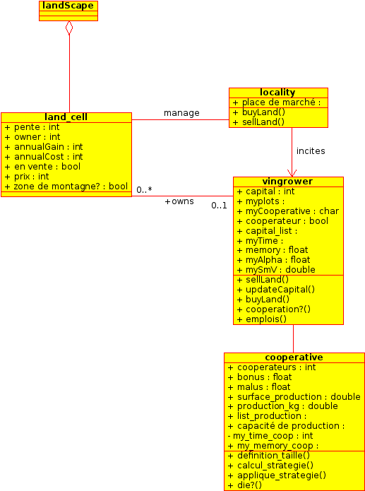
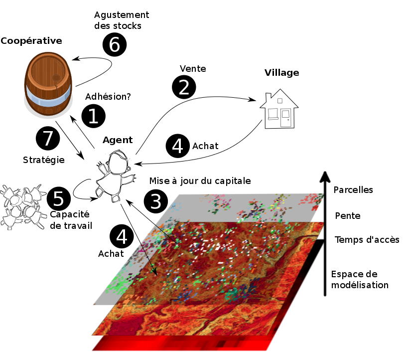
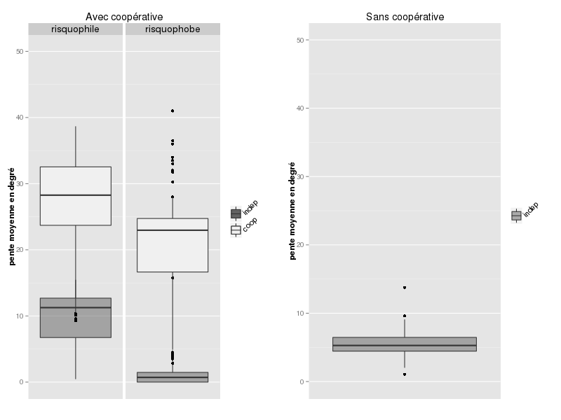

# The Cooperative : origin and consequence of mountain vinyarde landscapes?

# La Coopération : origines et conséquances des paysages de montagnes ?

[Etienne Delay](http://geolab.univ-bpclermont.fr/spip.php?article184)1,  [Marius Chevallier](http://geolab.univ-bpclermont.fr/spip.php?article182)1, [Eric Rouvellac](http://geolab.univ-bpclermont.fr/spip.php?article56)1 & [Fabio Zottele](http://www.fmach.it/CTT/Chi-siamo/Organizzazione/Dipartimento-Sperimentazione-e-Servizi-Tecnologici/Unita-Sistema-Informativo-Geografico/Zottele-Fabio)2

1 Laboratoire GEOLAB UMR 6042 CNRS Université de Limoges, FLSH, 39E rue Camille Guérin 87036 Limoges, France.

2 Fondazione Edmund Mach di San Michele all'Adige, Via E. Mach, 1 38010 S. Michele all'Adige (TN) - ITALY

This paper is comming soon in "[Journal of Alpine Reacher](http://rga.revues.org/)"

*__Abstract__*

In an economy of increased globalization and trade, wine holds a privileged place. The wine cooperative system in vineyards in mountain regions, such as in Banyuls-sur-Mer, France and the Val di Cembra, Italy, offers a privileged context for studying the opportunities for individual action that affect precarious socio-economic balances. To understand, and sometimes predict, changes in the socio-economics and landscapes of a region due to cooperatives, we have used a multi-agent system (MAS) to model the behavior of the actors involved in wine production in a cooperative. This model analyses cooperative systems’ impact on socio-economic factors (income inequality and the rate of business failure) and landscapes (percentage of total land as vineyards, particularly in steep areas) of the regions considered. The findings show that cooperatives play a role of socio-economic and landscape stabilizer in these regions

*_Keywords_*: vineyard landscape, slope, agent-based modeling, wine cooperative

*_Software applications used_*: 

The model was developed using the NetLogo programming language (Wilensky, 1999) with the Rserver-NetLogo extension (Thiele, 2011). The data were processed using R software (R Core Team, 2014), and output graphics were produced through its ggplot2 plotting system (Wickham, 2009). 

## Introduction ##
In France, cooperatives produce 41% of the wine.1 Yet, all French regions have not adopted cooperative organization to the same extent (Touzard et al. 2008). It has been observed, for example, that the French departments with considerable orographic conditions (Alpine departments, the Pyrenees, the Rhone Valley) widely use cooperative organization (Fig. 1). This article thus focuses on this type of mountain territory. While the literature on cooperative systems and especially wine cooperatives is abundant, covering economic (Piesse et al. 2005; Pitcher, 2012), sociological (Ewert, 2005; Chiffoleau et al. 2012), and geographic aspects (Schirmer, 2007; Touzard, 2010, Touzard et al., 2010), here we address the issues raised by a multi-agent system (MAS) (Banos, 2013). This type of approach makes it possible to explore and understand the complex interactions at work between societies and their territories, while starting from individual behavior (Bousquet and Le Page, 2004; Gilbert and Troitzsch, 2005). Using a MAS also enables an interdisciplinary approach, linking geography, economy, and local actors, with the model mediating among them (Smajgl et al., 2011).

**Figure 1** : Proportion of wine production (in hl) produced by cooperatives in 2013

We focused on the territories of AOC Banyuls Collioure in France and the Val di Cembra in Italy to build our model in an empirical and iterative manner (Janssen et al., 2006; Robinson et al. 2007; Smajgl et al., 2013). This construction was carried out on the basis of interviews and observations of the territories that were then formalized as ‘interaction agents’ in a model that we have entitled CIVIsMe.

For AOC Banyuls and Collioure (in the Mediterranean part of the French Pyrenees), cooperation plays a very important role. Today, three co-ops stand out: GICB, Étoile, and Dominicain, comprising just over 78% of the wine-growing areas and over 94% of the wineries of the territory. While independent organizations account for a non-negligible proportion of surface area (21%), they represent only a few wine growers (5%).

Generally speaking, cooperation in these territories is a necessity for many growers, who have very small vineyards (the average area per grower was 1.9 hectares in 2012) and limited oenological knowledge.  Since the income from the grape harvests barely covers the additional costs of production on sloping terrain, there has been gradual [abandonment of wine production on the slopes](http://www.coopdefrance.coop/fr/39/vin/).

The Val Di Cembra region (in the eastern part of the Italian Alps) is located in one of the five autonomous Italian regions with special status, the province of Trentino, which gives it high management flexibility. Thus, since the 1970s, viticulture has largely been subsidized to counter the general rural exodus. Cooperatives here also play a fundamental role in organizing the region, and wine growers deliver their harvests to two cooperatives: Cantina sociale di Lavis and Cantina sociale di Mezzocorona. Cooperatives ensure growers stable revenue which, combined with regional subsidies, provides growers with a relatively comfortable income.

In these two territories, there is a risk of decline in mountain viticulture (of varying degrees), due to rural exodus and a preference for viticulture on the plain. In this study, we seek to formalize and explore socio-economic (number and characteristics of holdings) and landscape (maintenance of viticulture) developments in a given region when agents are given the possibility of organizing themselves in a cooperative structure. The present study examines areas in which cooperatives already exist (and not the creation of cooperatives). Furthermore, we have chosen to focus on a cooperative's impact on its territory rather than on the internal operation of the cooperative, in contrast to Young (2002), Bowles et al. (2002) and Delay and Marcelin (2014). Based on single hypotheses concerning winegrowers' behavior, we analyze changes in the number of winegrowers and in the landscapes.

## Methodology 
###Developing the model
We describe the model based on a UML diagram1 (Fig. 2): each class is defined by three cases respectively comprising a class of agents and attributes (variables) presented in the paragraph "Entities, variables, scale" as well as potential processes (actions), which follow one another as presented in the paragraph "Processes and scheduling" (Fig. 3). This diagram also presents the links between the classes.

### Objectives 
We analyze the impact of the cooperative system on socio-economics (changes in the number of farmers and the size of vineyards, inequalities) and on the landscape (proportion of surface area planted as vineyards on the plain or on the slopes). 

### Entities, variables, and scale
The CIVIsMe model is designed to complement the LAME model (Delay et al. 2012)2 to address the question of cooperation in the wine producing areas, in addition to the land issues. The base unit (the scale) is the plot, which is uniform in size throughout the territory. The model includes two classes of reflective agents, which make decisions (growers and cooperatives) and three classes of non-reflective agents, i.e. those which do not make decisions (the landscape landscape, the plots landcell and the village locality). 

**Figure 2** : UML Diagram for CIVIsMe Model : agents and activities

The village is defined by its location and has two possible types of actions: sell plots to or buy plots from wine-growers (they do not sell or purchase their plots directly, but do so via the village, which serves as the marketplace). 
The landscape (landscape) consists of all the plots, growers, and villages. 
Each plot is defined by its slope, its owner (owner), annual earnings from its sales (annualGain), the costs generated by maintenance and production work (annualCost), its possible sale, its price and its location (plain or mountain).

* The growers (vingrowers) are defined by nine attributes:  
* Their financial resources (capital); 
* The list of their plots (myplots); 
* Their situation as an independent or within a cooperative (cooperateur); 
* The name of the cooperative to which they are affiliated, and their memory (memory calculated from capital_list and myTime) in which incomes from the past x years are stored to make decisions based on reason;

A propensity to accepting the risk of leaving the cooperative: when myAlpha is high, the grower is risk averse, otherwise the grower is risk prone; and
A capacity for reasoning mySmV to evaluate whether conditions at a given moment t are conducive to joining or leaving the cooperative.

Agents of the cooperative class are related to winegrower agents. The attribute of cooperateurs is assigned to growers who are members of the cooperative. Joining the cooperative has a financial impact: a bonus is attributed to them because the cooperative enables winegrowers to cut production costs by sharing winemaking equipment. A malus is assigned to cooperative members because the cooperative pays them a lower price for their harvest, since the grapes are unprocessed. The sum of members' plots gives the total area of the plots that are assigned to the cooperative (*surface\_production*), making it possible to deduce the volume of grapes to be produced (*production\_kg*) because all the plots in the model have the same yield. The cooperative, like the growers, is attributed with a memory that remembers their production capacities (*list\_production*) (always in kg of grapes), making it possible to define strategies (*my\_memory\_coop*) based on the past behavior of the farmer-members of the cooperative over time (*my\_time\_coop: number of years taken into account by the farmer-member to make decisions).

We consider that an iteration represents one year, which enables us to isolate management practices and resolve each iteration when the product reaches the market. 

### Processes and scheduling 
There are eight processes in this model (the numbers refer to Fig. 3) divided between two classes of agents in the following manner:

 1. Winegrower: 
 
 * Cooperation (1): remain cooperative or independent or change one's situation. A winegrower leaves the cooperative if the gains expected outside the cooperative are sufficiently above the alpha threshold and if the winegrower has sufficient financial resources to invest in the necessary winemaking equipment.
 * Sale of a plot to the village (2) as soon as end-of-year financial resources are insufficient to cover the expenses of the next winegrowing cycle.
Update of financial resources (updateCapital, 3).
 * Purchase of a plot (4): a year's profits are converted into the purchase of plots, with the requirement of maintaining sufficient financial resources to cope with the annual production costs.
 * Update of the amount of labor (emplois, 5): the amount of work depends on the number of plots and the slope of the plot. All agents have the same capacity for work. If the amount of work exceeds their capacity, part-time workers is employed.
 
 2. Cooperative:
 
 * Inventory adjustment (6, definition_taille): year-end tallying of requests to join or leave the cooperative and sum of the members’ plots, in order to calculate the total area allocated to the cooperative.
Strategy (7): 
 * Calculation of the strategy: the cooperative sets itself a maximum threshold volume of wine grapes by choosing a pre-defined factor according to size (this coefficient is calculated from changes in volumes over the past four years).
 * Implementation of the strategy: the cooperative accepts new members during the year if the total of their plots does not lead it to exceed the maximum threshold set earlier; otherwise it offsets their entry to the following year.
 * The model can also make the cooperative disappear to assess the impact of its absence (die).

A detailed description of the model is available in Appendix A.

**Figure 3** : Steps for the CIVIsMe process 

## Results and discussion

The results of this model can be approached from two angles to assess the cooperative's impact on the territory: first, assessing its impact on the structure of the socio-economic fabric, and second, on the continuation of winegrowing on sloped terrain. In the first simulation, all the areas had the same characteristics (at the original location near the plots, which is determined randomly for each simulation). Following that, we qualified these results on the cooperatives’ impacts by showing that the impacts vary according to the characteristics of the regions. In fact, we distinguished two types of areas according to whether joining or leaving the cooperative (to experiment with working individually) was more or less frequent. We named these areas ‘risk averse’ and ‘risk prone’ because leaving the cooperative means taking an individual risk:1 depriving oneself, at least temporarily, of a collective safety net. 

** Table 1 **: Average of 40 simulations for each parameter 

|   | With cooperative | Without cooperative |
| ---- | ----------------- | ------------------- |
| Gini index of winegrowers' incomes | 0.6586391 | 0.2259915 |
| Proportion of winegrower bankruptcy |27.20% | 89.08% |
| Capital of cooperative members |247,381.3 | NA |
| Capital of independent operators |636,612 | 1,668,960 |

Table 1 summarizes the results of 20,000 simulations. At first glance, these results may seem surprising, since income inequality was higher in a cooperative compared to not being in a cooperative (Gini index over 40%). Yet, these apparent inequities in a cooperative are due to the lower bankruptcy rate of small growers. In fact, the cooperative corrects inequalities because it reduces the risk of bankruptcy for smaller growers. The cooperative does not, however, result in a redistribution of income; rather, it perpetuates the level of local inequalities in accordance with Jayet’s research (1993). Thus, this enables the social and spatial fabric to continue to exist, as social positions are not changed (Bort, 2003) and there is no revenge of small landowners against large. However, the cooperative does prevent an increase in inequalities, since in the absence of a cooperative, the size of vineyards increases (capital greater than 38%) as a consequence of the bankruptcy of smaller growers whose land is acquired by the remaining growers.

It appears that the cooperative is positioned as an interface between the global market and local production (Pecqueur, 2007) in order to provide better economic results for the largest number. Small winemakers practicing part-time viticulture, like full-time winegrowers, find opportunities for sales through the same organization. More importantly, this even enables smaller growers to survive outside the cooperative. The results show that the capital of independent producers in a context with cooperatives is much lower than the capital of winegrowers in a context without cooperatives. This fact can be explained by the ‘safe haven’ aspect of the cooperative. Some growers remain in the cooperative over the long term, while others join the cooperative only to launch their business or in times of crisis. This option enables them to consolidate their vineyards, including those of small size which would not be able to survive difficult periods without this possibility of shelter. 

From a spatial and landscape point of view, here again, the existence of a cooperative had a considerable impact on the spatial organization of vineyards, as can be seen in Table 2:

**Table 2 **: Spatial organization of vineyards

| | With cooperative | Without cooperative |
| -- | -------------- | ------------------ |
Surface area of vineyards in the region | 36.91% |16.29% |
Average slope of cooperative holdings | 23.06483°| NA |
Average slope of individual holdings | 15.20068° | 5.592266°|
Average number of plots per cooperative member | 11.42197 | NA |
Average number of plots per individual outside the cooperative |19.42114 | 48.63426 |
Proportion of growers having a sloped plot | 58.16% | 12.57% |

Looking broadly at the regions under consideration, it is clear that the cooperative makes it possible to double the cultivated area: 37% of the region’s land is cultivated compared to 16% in a context without cooperatives. In particular, it is the steeper areas that are cultivated in a cooperative context. The steeper areas, which are more difficult to cultivate, are maintained primarily thanks to the cooperative: 58% of the growers cultivate steep plots (slope of over 10°) compared to slightly over 12% of growers in a context without cooperatives. In areas of steep slopes, fewer possibilities exist to reduce the costs associated with working in the vineyards (for example, no mechanical tractors are possible). Therefore, the possibility of reducing the costs of winemaking by pooling resources within a cooperative is an essential condition for continuing to cultivate such vineyards. The cooperative makes it possible to cultivate lands which would not be profitable without a cooperative. More importantly, continuing to cultivate plots on steep slopes maintains the collective identity of the region: these highly visible vineyards on steep slopes are essential for the regions’ image. Winegrowers who cultivate these sloping spaces work not only for themselves, but also for the collective by maintaining the identity from which all winegrowers, including the independent producers, benefit when marketing their wines.

In Banyuls, for example, we find very small vineyards (Briffaud and Dalavasse, 2012), cultivated by older winegrowers and retired people or as a supplementary job (Chiffoleau, 1999). According to our simulation results, it is likely that these winegrowers would not be able to cultivate on steep slopes without a cooperative. It is impossible to directly test the hypothesis that the cooperative structure enables the survival of vineyards on steep slopes, since we cannot simply remove a cooperative during a certain period in a given territory. Thus, simulation methods offer the advantage of testing situations which cannot be tested in real-life experiments.

In addition, there is the ‘safe haven’ effect observed in the analyzing the data of the previous table. The cooperative not only affects the average degree of slope cultivated by cooperative members, but also has an indirect effect on the average slope of independent growers, since they can seek ‘shelter’ in the cooperative in difficult times and thus do not have to abandon their less profitable land, particularly on steep slopes. The average slope of independent winegrowers in a context with cooperatives is three times higher, at 15°, than the average gradient of independent winegrowers in a context without cooperatives.

These results may of course vary according to the types of regions, and many additional features can also be incorporated through various extensions of the model. Here, we distinguish between ‘risk-averse’ and ‘risk-prone,’1 which differentiates the regions of Val di Cembra and Banyuls (see Appendix A for the formal integration of these concepts within the model). Insofar as the Val di Cembra benefits from a policy of subsidies linked to the specific status of the Province of Trento (and not specific to cooperatives), winegrowers' revenues are relatively higher than those of Banyuls. Thus, the Italian growers are less motivated to increase their income, for example, by testing individual ways of working to sell their crops at a higher price. Conversely, since wine growing does not benefit from such subsidies in Banyuls, incomes there are low and growers probably feel a greater need to seek ways to get a higher price for their crops, including via individual trajectories as our interviews demonstrated. The box plot diagram in Figure 4 presents the results for a single variable (average slope) for three territories: a risk-prone region with a cooperative, a risk-averse region with a cooperative, and a region without a cooperative. Since we define risk aversion/propensity here as the inclination to follow individual rather than collective trajectories (see note 5), it is unnecessary to introduce this distinction into a context without cooperatives.

As for the average slope of the vineyards, (Fig. 4) there is a difference between regions with and without a cooperative compared with the results of all regions combined based on Table 2. While independent winegrowers always have a higher average slope than in the context without cooperatives, in this case, the independent winegrowers from the risk-averse regions with a cooperative have an average slope less than that of the wine growers without a cooperative. However, this does not call into question the general result that the cooperative protects the steeper vineyards better, since the average slope for all growers combined remains higher. 

**Figure 34** : Results for 1040 simulations

Analysis of the indicators in Table 3 provides a better understanding of the variability of the impacts of cooperatives based on the regions’ characteristics. Although the cooperative provides protection from business failure, it only tempers the risk of failure depending on the cultural or political characteristics of the region (see note 6). Yet, the cooperative can also affect the bankruptcy threshold and constitute a tool for regional policy: if it makes the conditions for joining or leaving the cooperative more difficult, it helps limit the number of bankruptcies. While many theorists argue for more lenient cooperative by-laws (for a review of the literature, see Chevallier 2013), these findings show that stricter cooperative rules can serve the general interest. In a context of excessive concentration of holdings in the hands of a few, which means the risk of a low transmission of local culture and the region's dependence on decisions made by a few individuals, it may be beneficial to have more control over joining and leaving cooperatives (for example by only allowing exits once per year through a vote during the Annual General Meeting). Yet, Table 3 shows no difference in the proportion of the region that is cultivated. 

**Table 3** : Comparison of risk-averse and risk-prone territories with cooperatives 

|   | Risk-averse region | Risk-prone region |
| -- | ----------------- | ----------------- |
|Surface area of vineyards in the region  | 34.8% | 38.1% |
|Average slope of cooperative member holdings | 27.4° | 20.15°|
|Average slope of individual holdings | 9.6 | 1.7° |
|Proportion of failed winegrowers  | 30.5% | 24.1% |

## Conclusion
From the point of view of cooperative organization, the historic objective has been to maintain viable viticulture for the largest number of growers. Offering a quality product corresponding to the market and the desires of consumers are relatively new goals for cooperatives. To motivate cooperative members to work towards these new objectives involves mobilizing marketing tools that relate to the connections between the winegrower, the landscape and the consumer (Schirmer, 2007). In the two regions studied here, the vineyard landscape is widely used to promote the region's products on the market (Alcaraz, 2001).

The cooperative system, widely criticized as "an archaic form, unsuited to the current challenges of globalization" (Draperi and Touzard., 2003), should be considered as the historical catalyst of these landscapes, rather than as an obstacle to be circumvented by accelerating the dynamics of standardization announced by Oppenheimer in the 1920s and promoted by many writers and jurists throughout the 20th century (Nicolas and Vienney, 1995). All types of producers (cooperative and independent), benefit at different levels from the existence of cooperatives, which promote the continuation of winegrowing in mountainous and steep terrain. At the socio-economic level, the cooperative may also be considered to be a stabilizer, in line with Vienney (1980). In the end, the cooperative is a means of preserving both the landscape and the social fabric by enabling small winegrowers to continue to exist without threatening larger producers. In the final analysis, maintaining these landscapes is vital for marketing in the communications and in the architectural heritage that are proposed to wine lovers, who appreciate the beverage as much as they do its place of origin.

## References

Alcazar F., 2001, L’utilisation publicitaire des paysages de terrasses, Études Rurales, n°157-158, 195–209.

Banos A., 2013, Pour des pratiques de modélisation et de simulation libérées en géographie et SHS, Habilitation à Diriger des Recherches, Université Paris 1 Panthéon Sorbonne.

Bousquet F., Le Page C., 2004, Multi-agent simulations and ecosystem management: a review. Ecological Modelling, n°176, 313–332. doi:10.1016/j.ecolmodel.2004.01.011

Bort F., 2003, Du rouge aux terroirs : De la tactique coopérative à la coopération tactique. Les coopératives entre territoires et mondialisation, Paris, L’Harmattan.

Bowles S., Gintis, H., 2002, Origins of human cooperation. Genetic and cultural evolution of cooperation, Dahlem workshop report (Massachusetts Institute of Technologies and Freie Universität Berlin.), London, England.

Chiffoleau Y., Dreyfus F., Touzard J-M., 2012, Ethics in French Wine Cooperatives : Part of Social Movement?, in Creating Food Futures: Trade, Ethics and the Environment. Gower Publishing, Ltd.

Delay E., Bourgoin J., Zottele F., Andreis D., 2012, LAME: un outil pour comprendre les dynamiques spatiales des territoires viticoles de montagne, IV congrès international de la viticulture de montagne et de fortes pentes, Lyon, 80–85.

Delay E., Chevallier M., sous presse, Roger Dion, toujours vivant!, Cybergeo : European Journal of Geography.

Delay E., Marcelin F., 2014, Les territoires viticoles, entre espace d’innovation et innovation d’espaces, in Vin, innovation et mondialisation: Enjeux et perspectives. Présenté à Vin, innovation et mondialisation: enjeux et perspectives, Toulouse, France, 1–13.

Draperi J-F., Touzard J-M., 2003, De Maraussan 1901 à Maraussan 2001 : coopératives, territoires et mondialisation, in Les coopératives entre territoires et mondialisation, L’Harmattan, 77-90.

Ewert J., 2005, How competitive is South Africa ? Advances and challenges in the transformation of the Cape wine industry. Les Cahiers d’Outre-Mer, n° 58, 371–396. Doi: 10.4000/com.305

Gilbert N., Troitzsch K-G., 2005, Simulation for the social scientist, 2nd Revised edition. Ed. Open university press.

Hinnewinkel J-C., 2003, Résistances et adaptations : Le renouveau des vignobles de montagne en Europe de l’Ouest, un bel exemple d’efficacité des appellations face à la mondialisation ou à quelles conditions le maintien d’une viticulture de montagne est-il envisageable?, in Crise et mutation des agricultures de montagne, CERAMAC, Clermont-Ferrand, Presses Université Blaise Pascal, 399–408.

Janssen M-A., Ostrom E., 2006, Empirically Based, Agent-based models, Ecology and Society, 11(2): 37.

Jayet H., 1993, Territoires et concurrence territoriale, Revue d’économie régionale et urbaine, 1: 55–75.

Pecqueur B., 2006, Le tournant territorial de l’économie globale. Espaces et sociétés 124-125, 17–32.

Piesse J., Doyer T., Thirtle C., Vink N., 2005, The changing role of grain cooperatives in the transition to competitive markets in South Africa. Journal of Comparative Economics 33, 197–218. Doi: 10.1016/j.jce.2004.10.002

Pitcher A., 2012, Was privatisation necessary and did it work? The case of South Africa. Review of African Political Economy 39, 243–260. Doi: 10.1080/03056244.2012.688803

R Development Core Team, 2014, R: A Language and Environment for Statistical Computing. R Foundation for Statistical Computing, Vienna, Austria.

Robinson D-T., Brown D-G., Parker D-C., Schreinemachers P., Janssen M-A., Huigen M., Wittmer H., Gotts N., Promburom P., Irwin E., 2007, Comparison of empirical methods for building agent-based models in land use science, Journal of Land Use Science, 2(1): 31–55.

Smajgl A., Brown D-G., Valbuena D., Huigen M-G-A., 2011. Empirical characterisation of agent behaviours in socio-ecological systems. Environmental Modelling & Software 26, 837–844. Doi:10.1016/j.envsoft.2011.02.011

Smajgl A., Barreteau O., 2013, Empirical Agent-Based Modelling: Challenges and Solutions: The Characterisation and Parameterisation of Empirical Agen-Based Models. New York: Springer-Verlag New York Inc.

Schirmer R., 2007, Les coopératives vinicoles entre marques et terroirs, in: Les Terroirs : Caractérisation, Développement Territorial et Gouvernance. Présenté au colloque international sur les terroirs, Aix-en-Provence, 85–90.

Thiele J-C., Grimm V., 2010, NetLogo meets R: Linking agent-based models with a toolbox for their analysis, Environmental Modelling &amp; Software, 25(8): 972 – 974.

Touzard J-M., Coelho A., Hannin H., 2008, Les coopératives vinicoles : une analyse comparée à l’échelle internationale. Bulletin de l’OIV, vol. 81, n° 929-930-931, 381–404.

Touzard J-M., Draperi J-F., Collectif, 2003, Les coopératives entre territoires et mondialisation. Paris, L’Harmattan.

Wickham H., 2009, ggplot2: elegant graphics for data analysis. Springer New York. Retrieved from http://had.co.nz/ggplot2/book

Wilensky U., 1999, NetLogo. logo, Northwestern University. Evanston, IL: Center for Connected Learning and Computer-Based Modelling. Retrieved from http://ccl.northwestern.edu/netlogo/

Young H-P., 2002, The power of norms. Genetic and cultural evolution of cooperation, Dahlem workshop report (Massachusetts Institute of Technologies and Freie Universität Berlin.). London, England.

# Acknowledgement
Le poster à été réaliser grace au soutient de l'[Agence Matienne](http://www.agence-martienne.fr/) et de le [Maison d'Ailleurs](http://www.ailleurs.ch/), d'après une idée original issu de l'exposition "[Amazing science](http://www.cea.fr/var/cea/jeunes/amazing-science/index.html#/echangeur/)". Nous avons réutiliser le titre de l'exposition avec l'aimable autorisation du [CEA](http://www.cea.fr/le-cea/amazing-science-une-exposition-pulp-et-sci) et de l'[INSERME](http://www.inserm.fr/index.php/actualites/rubriques/actualites-evenements/amazing-science-une-exposition-pulp-et-scientifique).

Ce poster à été réaliser à partir d'une image original de la collection de l'[Agence Matienne](http://www.agence-martienne.fr/) & le [Maison d'Ailleurs](http://www.ailleurs.ch/) issu du [Pulp magazines](http://en.wikipedia.org/wiki/Pulp_magazine), "_Amazing Stories_" de janvier 1942 par Frank Patton. L illustration de Malcolm Smith très inquiétante représnte l'expérimentation sur une femme à l'époque du poste à galène et du tube à vide…

Travail réalisé dans le cadre de la thèse de doctorat de Etienne Delay, avec le soutient de du laboratoire GEOLAB UMR 6042 CNRS, et de la réuion Limousin.

  
